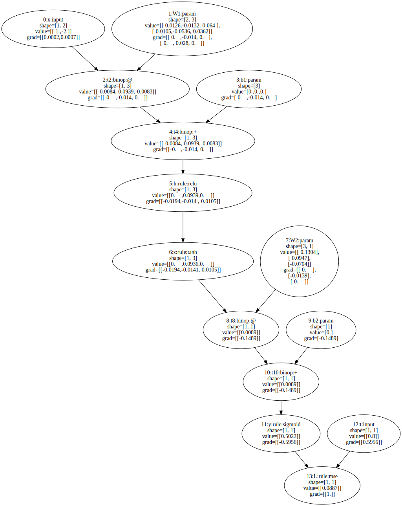

# WhiteNN

WhiteNN is a tiny domain-specific language for "white-boxing" core neural network
mechanisms. It is designed for education and experimentation: you write models,
rules, and training steps in a small, explicit syntax, and WhiteNN builds a
computational graph, differentiates it, and applies optimizers, which is suitable for new learners and researchers.

## Core Idea / Design Motivation

Modern frameworks often hide critical details behind opaque APIs. WhiteNN makes
those details visible and explicit:

- A `graph { ... }` block builds a DAG of computation nodes.
- `loss`, `grad`, `explain`, and `step` expose the learning loop directly.
- `rule` lets you define custom ops with local derivatives.
- Explain outputs can render the graph and chain-rule traces.

The goal is a small, readable language that clarifies how neural computation,
autodiff, and optimization work.

## Core Features

- **Models and parameters:** `model` blocks with typed params and initializers.
- **Rules with derivatives:** `rule` defines forward + local gradients.
- **Graph building:** `graph { ... }` for differentiable computation.
- **Loss & gradients:** `loss` extends graph, `grad` runs reverse-mode AD.
- **Training steps:** `step SGD(...) using g;` updates params.
- **Explainability:** level 0/1/2 explain output, where:
  - level 0: Each param's gradient norm.
  - level 1: Computation graph (DOT graph rendering) with all nodes' forward + gradient values.
  - level 2: Chain-rule narratives with trace contributions.
- **Host control:** `for` loops, `if` statements, helper functions.
- **Errors with location:** file/line/column diagnostics and hints.

## Dependencies

- Python 3.10+
- `lark`
- `numpy`
- Graphviz (`dot`) for SVG/PNG graph rendering

## Install / Run

For a local editable install:

```
pip install -e .
```

If build isolation causes network issues, use:

```
pip install -e . --no-build-isolation
```

Run a program:

```
python -m whitenn examples/hello_whitenn.wnn
```

After install, you can also run:

```
whitenn examples/hello_whitenn.wnn
```

## Example: One-step MLP Training

```
// Example: implement a simple MLP with one training step, plus different activation funcs.

model MLP {
  param W1[2,3] init normal(0, 0.1);
  param b1[3]   init zeros;
  param W2[3,1] init normal(0, 0.1);
  param b2[1]   init zeros;
}

rule relu(x: Real) : Real {
  forward = max(0, x);
  d/dx    = (x > 0) ? 1 : 0;
}

rule sigmoid(x: Real) : Real {
  forward = 1 / (1 + exp(-x));
  d/dx    = sigmoid(x) * (1 - sigmoid(x));
}

rule tanh(x: Real) : Real {
  forward = (exp(x) - exp(-x)) / (exp(x) + exp(-x));
  d/dx    = 1 - tanh(x) * tanh(x);
}

rule mse(y: Real, t: Real) : Real {
  forward = (y - t) * (y - t);
  d/dy = 2 * (y - t);
  d/dt = -2 * (y - t);
}

fn train_step(x[2], t[1]) {
  graph {
    h = relu(x @ W1 + b1);
    z = tanh(h);
    y = sigmoid(z @ W2 + b2);
    t0 = t;
  }
  loss L = mse(y, t0);
  grad g = derive L wrt {W1, b1, W2, b2};
  explain g level 1 to "artifacts/mlp-graph.svg";
  explain g level 2;
  step SGD(lr=0.1) using g;
}

train_step([[1.0, -2.0]], [[0.8]]);

```
Computation graph of MLP (SVG) with `explain g level 1 to "artifacts/mlp-graph.svg";`:



Gradient chain-rule trace with `explain g level 2;`:

```
Explaining Gradients for loss 'L':
-----------------------------------------------------
For W1 (shape [2, 3]):
∂L/∂W1 = ∂L/∂y * ∂y/∂t10 * ∂t10/∂t8 * ∂t8/∂z * ∂z/∂h * ∂h/∂t4 * ∂t4/∂t2 * ∂t2/∂W1
where:
    L = mse(y, t0)
    y = sigmoid(z @ W2 + b2)
    t10 = t8 + b2
    t8 = z @ W2
    z = tanh(h)
    h = relu(x @ W1 + b1)
    t4 = t2 + b1
    t2 = x @ W1
Explanation:
Trace:
  node t2
    upstream = [[-0.   ,-0.014, 0.   ]]
    -> W1: left.T @ upstream = [[ 0.   ,-0.014, 0.   ],
 [ 0.   , 0.028, 0.   ]]
  total = [[ 0.   ,-0.014, 0.   ],
 [ 0.   , 0.028, 0.   ]]
Therefore:
    ∂L/∂W1 = output_grad * mse'(y) * sigmoid'(t10) * 1 * W2^T * tanh'(h) * relu'(t4) * 1 * x^T
-----------------------------------------------------
For b1 (shape [3]):
∂L/∂b1 = ∂L/∂y * ∂y/∂t10 * ∂t10/∂t8 * ∂t8/∂z * ∂z/∂h * ∂h/∂t4 * ∂t4/∂b1
where:
    L = mse(y, t0)
    y = sigmoid(z @ W2 + b2)
    t10 = t8 + b2
    t8 = z @ W2
    z = tanh(h)
    h = relu(x @ W1 + b1)
    t4 = t2 + b1
Explanation:
Trace:
  node t4
    upstream = [[-0.   ,-0.014, 0.   ]]
    -> b1: upstream * 1 = [ 0.   ,-0.014, 0.   ]
  total = [ 0.   ,-0.014, 0.   ]
Therefore:
    ∂L/∂b1 = output_grad * mse'(y) * sigmoid'(t10) * 1 * W2^T * tanh'(h) * relu'(t4) * 1
-----------------------------------------------------
For W2 (shape [3, 1]):
∂L/∂W2 = ∂L/∂y * ∂y/∂t10 * ∂t10/∂t8 * ∂t8/∂W2
where:
    L = mse(y, t0)
    y = sigmoid(z @ W2 + b2)
    t10 = t8 + b2
    t8 = z @ W2
Explanation:
Trace:
  node t8
    upstream = [[-0.1489]]
    -> W2: left.T @ upstream = [[ 0.    ],
 [-0.0139],
 [ 0.    ]]
  total = [[ 0.    ],
 [-0.0139],
 [ 0.    ]]
Therefore:
    ∂L/∂W2 = output_grad * mse'(y) * sigmoid'(t10) * 1 * z^T
-----------------------------------------------------
For b2 (shape [1]):
∂L/∂b2 = ∂L/∂y * ∂y/∂t10 * ∂t10/∂b2
where:
    L = mse(y, t0)
    y = sigmoid(z @ W2 + b2)
    t10 = t8 + b2
Explanation:
Trace:
  node t10
    upstream = [[-0.1489]]
    -> b2: upstream * 1 = [-0.1489]
  total = [-0.1489]
Therefore:
    ∂L/∂b2 = output_grad * mse'(y) * sigmoid'(t10) * 1
-----------------------------------------------------
```
## Example Demos

- `examples/hello_whitenn.wnn`
- `examples/linear_regression.wnn`
- `examples/mlp_one_step.wnn`
- `examples/transformer_block.wnn`
- `examples/transformer_preference.wnn`

Negative examples:

- `examples/loss_before_graph.wnn`
- `examples/assign_param.wnn`
- `examples/mystery_no_rule.wnn`
- `examples/unknown_rule_deriv_target.wnn`
- `examples/unknown_rule_call.wnn`

## Notes

- WhiteNN separates host control from graph computation.
- Graph expressions disallow indexing; use host code + `fetch` to materialize
  values if you need to index.
- Explain level 1 requires an output path (SVG/PNG).

## License
MIT
